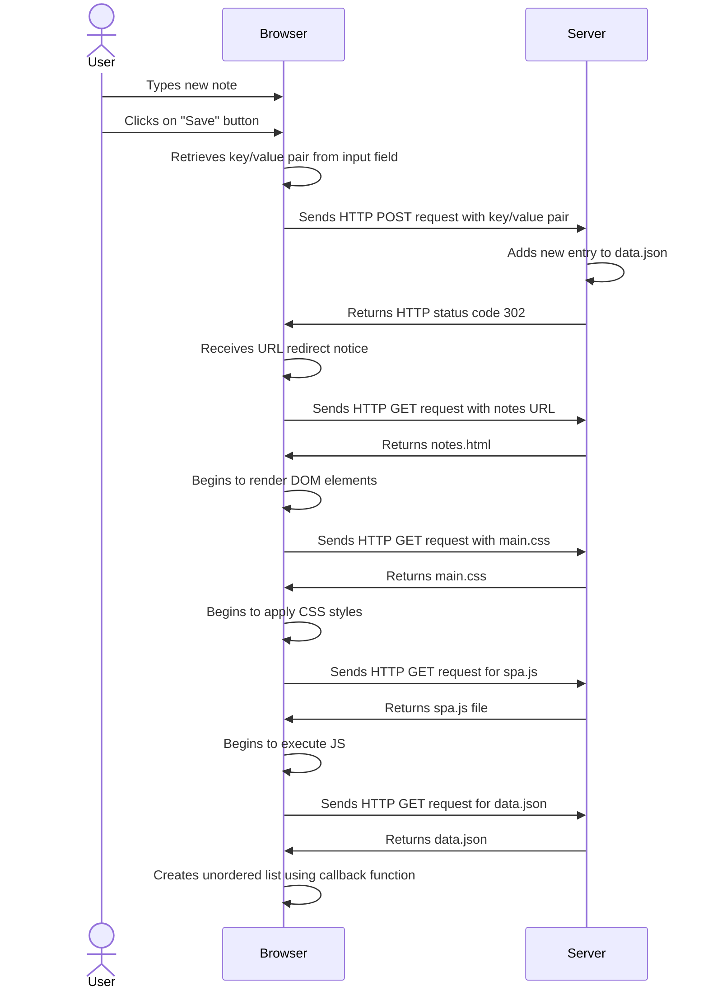

# Exercise 0.4

```mermaid
sequenceDiagram
  actor User
  participant Browser
  participant Server
  User->>Browser: Types new note
  User->>Browser: Clicks on "Save" button
  Browser->>Browser: Retrieves key/value pair from input field
  Browser->>Server: Sends HTTP POST request with key/value pair
  Server->>Server: Adds new entry to data.json
  Server->>Browser: Returns HTTP status code 302
  Browser->>Browser: Receives URL redirect notice
  Browser->>Server: Sends HTTP GET request with notes URL
  Server->>Browser: Returns notes.html
  Browser->>Browser: Begins to render DOM elements
  Browser->>Server: Sends HTTP GET request with main.css
  Server->>Browser: Returns main.css
  Browser->>Browser: Begins to apply CSS styles
  Browser->>Server: Sends HTTP GET request for spa.js
  Server->>Browser: Returns spa.js file
  Browser->>Browser: Begins to execute JS
  Browser->>Server: Sends HTTP GET request for data.json
  Server->>Browser: Returns data.json
  Browser->>Browser: Creates unordered list using callback function
```