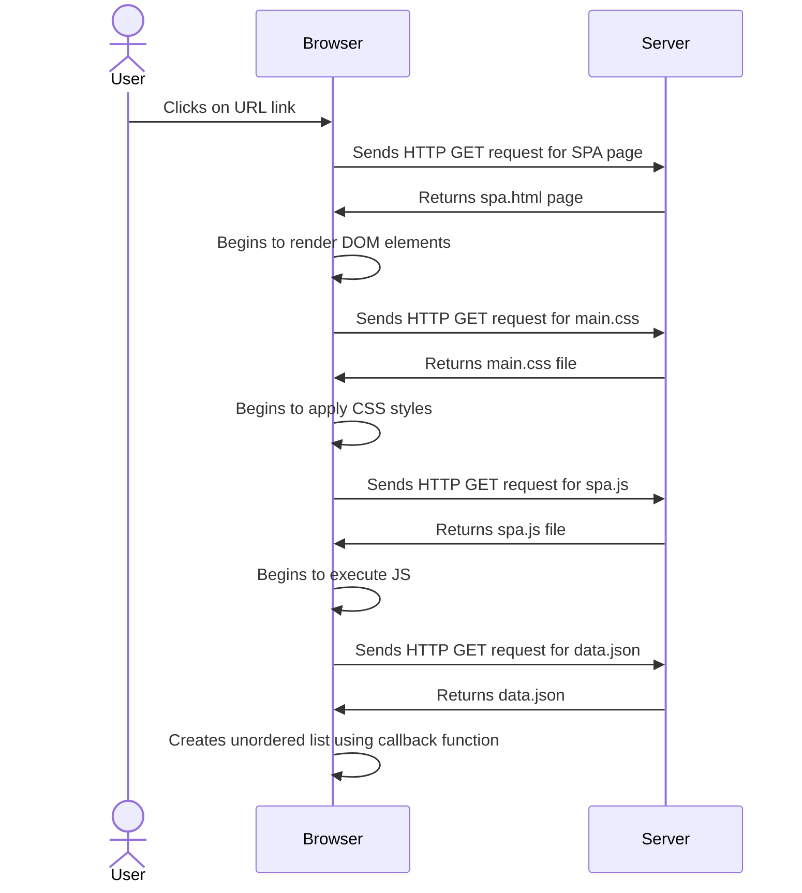

# Exercise 0.5

```mermaid
sequenceDiagram
  actor User
  participant Browser
  participant Server
  User->>Browser: Clicks on URL link
  Browser->>Server: Sends HTTP GET request for SPA page
  Server->>Browser: Returns spa.html page
  Browser->>Browser: Begins to render DOM elements
  Browser->>Server: Sends HTTP GET request for main.css
  Server->>Browser: Returns main.css file
  Browser->>Browser: Begins to apply CSS styles
  Browser->>Server: Sends HTTP GET request for spa.js
  Server->>Browser: Returns spa.js file
  Browser->>Browser: Begins to execute JS
  Browser->>Server: Sends HTTP GET request for data.json
  Server->>Browser: Returns data.json
  Browser->>Browser: Creates unordered list using callback function
```