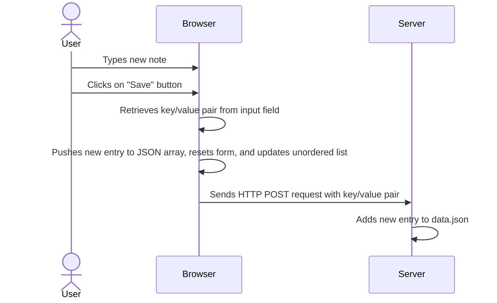

# Exercise 0.6

```mermaid
sequenceDiagram
  actor User
  participant Browser
  participant Server
  User->>Browser: Types new note
  User->>Browser: Clicks on "Save" button
  Browser->>Browser: Retrieves key/value pair from input field 
  Browser->>Browser: Pushes new entry to JSON array, resets form, and updates unordered list
  Browser->>Server: Sends HTTP POST request with key/value pair
  Server->>Server: Adds new entry to data.json
```